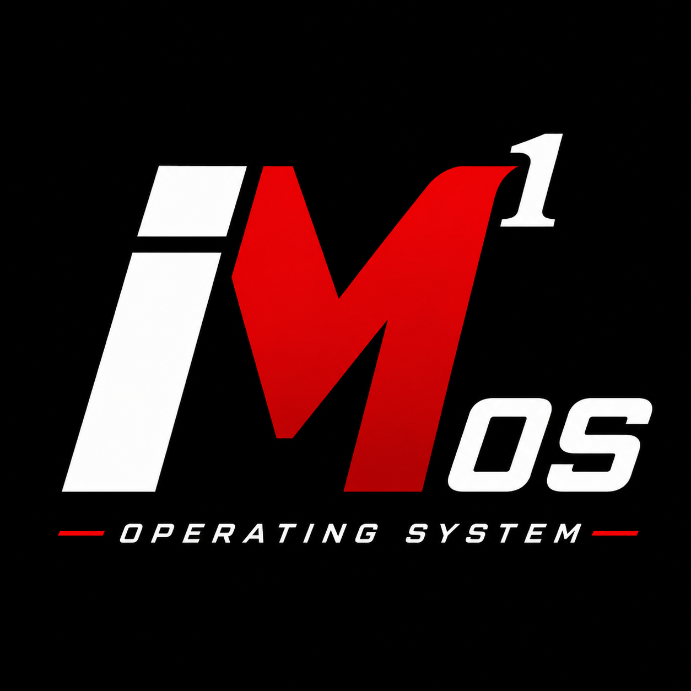

# IM1 Platform Control Plane Specification

Status: scope document.



The IM1 Platform is the control plane above every tenant.

It is not part of any dealer's business administration area.

It is IM1's SaaS operating layer: the system used to manage tenants, subscriptions, provisioning, billing relationships, feature access, health, support, deployments, usage, and platform analytics across the entire IM1OS ecosystem.

## Brand Direction

IM1 Platform should use the supplied iM1os Operating System mark as the primary control-plane brand signal. The mark should appear in Platform navigation and first-screen Platform entry points, including the dashboard and login experience.

The preferred presentation is the red, white, and black iM1os lockup with the Operating System tagline. Platform surfaces should keep the mark legible, avoid recoloring it, and pair it with restrained admin UI styling.

## Product Split

IM1 should be understood as three related products.

### 1. IM1 Platform

IM1 Platform is IM1's business control center.

Scope:

- Tenant Manager
- Provisioning
- Billing and licensing
- Merchant onboarding
- Feature flags and module licensing
- Monitoring and health
- Deployments
- Support and safe impersonation
- Platform analytics
- Platform-wide integrations

### 2. IM1OS

IM1OS is the tenant operating system used by each independent shop.

Scope:

- Business administration
- Human Resources
- Customers
- Vehicles
- Work orders
- Estimates
- Parts
- Inventory
- Supplier integrations
- Intelligence engines
- Customer portal

### 3. IM1 Network

IM1 Network is the ecosystem layer.

Scope:

- Dealer marketplace
- Shared intelligence
- Rewards and contingency
- Procurement network
- Supplier promotions
- Benchmarking
- Social and Market Intelligence
- Future consortium capabilities

The Platform runs the SaaS. The OS runs the shop. The Network connects everyone.

## Tenant Manager

Tenant Manager is the first major IM1 Platform module.

It should act as Mission Control for every IM1OS tenant.

Tenant list fields may include:

- Tenant name
- Status
- Plan
- Version
- Login account count
- Location count
- Last login
- Health status

Tenant detail should expose:

- Organization profile
- Subscription
- Billing
- Login accounts
- Locations
- Usage
- Storage
- Supplier connections
- Merchant account
- Health
- Support tickets
- Logs
- Feature flags
- AI usage
- Modules enabled
- Invoices

## Provisioning

Provisioning should eventually automate tenant creation.

Target flow:

```text
Create Organization
  -> Create database records
  -> Create storage
  -> Assign subscription
  -> Create initial owner login account
  -> Generate trial
  -> Enable modules
  -> Send welcome email
  -> Ready
```

Provisioning must be auditable and repeatable. Manual platform administration should become the exception, not the normal path.

## Billing And Licensing

Platform billing scope:

- Recurring billing
- Invoices
- Trials
- Coupons
- Promotions
- Usage billing
- Module billing
- Merchant billing
- Plan changes
- Suspension and reactivation

Payment provider decisions are not finalized. Billing scope should remain provider-agnostic until discovery is complete.

## Feature Management

The platform must be able to control which modules and capabilities are enabled for each tenant.

Examples:

- Service
- Parts
- Marketplace
- Merchant Services
- AI
- Procurement Intelligence
- Network Intelligence

Feature access should be tied to licensing, rollout, support, and tenant readiness.

## Deployment Management

Long-term deployment scope:

```text
Deploy version
  -> Test tenants
  -> Beta tenants
  -> Everyone
```

The platform should eventually support staged rollouts, tenant version visibility, rollback awareness, and deployment health.

## Tenant Health

Tenant health should track:

- Database
- API
- Storage
- Background jobs
- Emails
- SMS
- Payments
- Supplier sync
- Merchant connectivity
- AI usage failures

Health is platform-level visibility, not tenant business reporting.

## Support And Impersonation

Platform support may require safe tenant impersonation.

Rules:

- Impersonation must be explicitly authorized.
- Read-only impersonation should be preferred where possible.
- Every impersonation session must be audited.
- Every action during impersonation must preserve actor identity.
- Tenants should eventually be able to see support access history.

## AI Usage

Future platform AI usage tracking:

- Tokens
- Models
- Recommendations
- Monthly cost
- Savings generated
- Tenant-level limits
- Module-level usage

AI usage belongs in platform administration because it affects cost, billing, limits, and support.

## Platform Marketplace

Platform marketplace administration may manage:

- Themes
- Modules
- Apps
- Pricing
- Supplier-sponsored offers
- Marketplace availability

This is distinct from the customer-facing Commerce Network.

## Platform Analytics

Platform-wide analytics are not tenant dashboards.

Potential metrics:

- Tenants
- MRR
- ARR
- Churn
- Retention
- Login accounts
- Transactions
- Supplier orders
- Merchant volume
- AI usage
- Module adoption
- Support load

Platform analytics must not expose tenant confidential data to other tenants.

## Non-Goals For First Implementation

- Do not build a complete billing system before provider and legal discovery.
- Do not implement support impersonation without audit and permission controls.
- Do not build deployment automation before the release process exists.
- Do not mix Platform Administration with tenant Business Administration.
- Do not expose platform analytics to tenants unless explicitly designed as tenant-safe benchmarking.

## Discovery Questions

- Should IM1 Platform be a separate web app, separate API area, or separate module in the same deployment?
- Which login accounts are platform administrators, and how are they authenticated?
- What tenant lifecycle states are required: trial, active, suspended, canceled, archived?
- Which provisioning steps must be automated for the first paid tenant?
- Which billing provider or merchant provider should be used first?
- What support impersonation controls are legally and operationally required?
- What platform metrics are needed before launch?

## Success Criteria

The IM1 Platform succeeds when IM1 can:

- Create and manage tenants from a control plane.
- Understand tenant status, plan, usage, health, and module access.
- Provision new organizations repeatably.
- Support tenants safely with full auditability.
- Manage billing, licensing, and feature access.
- See platform-wide business health without violating tenant boundaries.
